<picture><source media="(prefers-color-scheme: dark)" srcset="assets/banner-dark.svg"></picture>

I'm a freelance full-stack developer. I build the systems a business opens every morning: the CRM its sales team works from, the billing and stock system behind the counter, the HR system that runs attendance and payroll. Most of my clients come to me running on Excel, paper registers and WhatsApp groups, and leave with one system that holds all of it.

I work on the principle that **software should fit the business, not the other way round**. I learn how the work is really done before I model anything, and the data model follows that.

 

## Activity

<!-- stats:start -->
<picture><source media="(prefers-color-scheme: dark)" srcset="assets/commits-dark.svg"></picture>
<picture><source media="(prefers-color-scheme: dark)" srcset="assets/rhythm-dark.svg"></picture>

The same numbers as a table

| Measure | Value |
| --- | --- |
| Commits, last 30 days | 518 |
| Active days, last 30 days | 29 of 30 |
| Projects with commits, last 30 days | 3 |
| TypeScript share of code in active projects | 51% |
| JavaScript share of code in active projects | 49% |

| Week ending | Commits |
| --- | --- |
| 21 Jul 2026 | 24 |
| 28 Jul 2026 | 76 |
| 4 Aug 2026 | 8 |
| 11 Aug 2026 | 46 |
| 18 Aug 2026 | 99 |
| 25 Aug 2026 | 86 |
| 1 Sep 2026 | 98 |
| 8 Sep 2026 | 94 |
| 15 Sep 2026 | 98 |
| 22 Sep 2026 | 128 |
| 29 Sep 2026 | 95 |
| 6 Oct 2026 | 156 |

Counted from my commits on the default branch of every repository I work in, private ones included. Updated 6 Oct 2026.
<!-- stats:end -->

## In progress

Client work lives in private repositories, so it's described here without client names. The activity on each card is read from the commit history.

<picture><source media="(prefers-color-scheme: dark)" srcset="assets/project-crm-dark.svg"></picture>
<picture><source media="(prefers-color-scheme: dark)" srcset="assets/project-bms-dark.svg"></picture>
<picture><source media="(prefers-color-scheme: dark)" srcset="assets/project-careeriq-dark.svg"></picture>
<a href="mailto:kunal.kkchaudhary@gmail.com"><picture><source media="(prefers-color-scheme: dark)" srcset="assets/contact-dark.svg"></picture></a>

## What I build

| System | What it covers |
| --- | --- |
| **CRM** | Leads, accounts, visits and follow-ups, territories, sales targets, approval workflows, dashboards for managers |
| **BMS / ERP** | Invoicing and GST, party ledgers, cash and bank book, stock and inventory, sync with accounting packages such as Tally |
| **HRMS** | Employee records, attendance, leave, payroll, role-based access |
| **Internal tools** | Point-of-sale registers, reporting, PDF and Excel exports, notifications, integrations with systems the business already has |

## How I work

- **I start with the business, not the schema.** I sit with the people who do the work, follow an invoice or a lead from start to finish, and build to that. Staff shouldn't need retraining to use their own process.
- **One developer, the whole system.** Requirements, data model, interface, deployment and support come from the same person, so nothing is lost between hand-offs.
- **Small phases, working software.** Each phase ships something the business can use, and the next one is planned from how they used it.
- **I stay after launch.** A business changes, and its system has to change with it. Most of my projects continue as new modules and maintenance.

## AI

I build with AI tooling every day and keep the architecture, the data model and the review in my own hands. In client systems I add AI where it removes real work:

- Assistants that answer questions from the business's own data
- Extraction from documents such as résumés, invoices and PDFs into structured records
- Agents and scheduled automations for repetitive back-office tasks

## Stack

**Day to day**

     

**Data**

   

**Also**

  

**AI**

  

**Integrations and infrastructure**

     

## Background

B.Tech in Computer Science and Engineering, KIIT University, Bhubaneswar (2022 to 2026). I've been building for small businesses since 2022, and spent a year teaching Java, Python and SQL to working professionals.

## Achievements

<!-- achievements:start -->

<!-- achievements:end -->

## Contact

Based in Kolkata, India (IST, UTC+5:30), working with clients remotely and on site.

 
